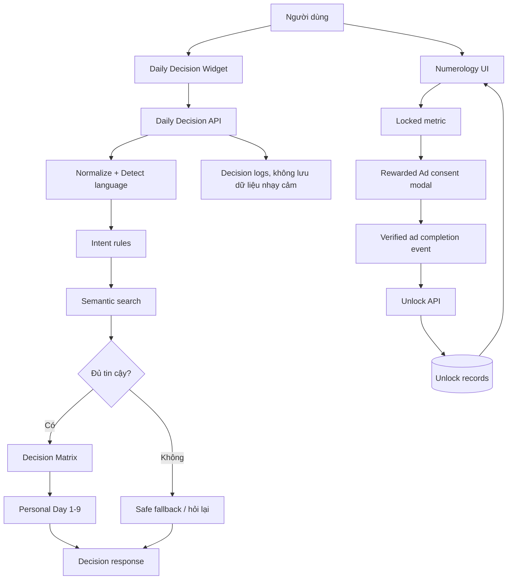

# Kế hoạch triển khai đã chỉnh sửa

> **Trạng thái:** Đã dừng/ngoài phạm vi. Đây là kế hoạch lịch sử cho Daily Decision và rewarded ads. Không dùng tài liệu này làm roadmap hiện tại; scope hiện tại chỉ là một RAG Q&A duy nhất.

## Daily Decision Maker và cơ chế mở khóa bằng Rewarded Ads

Ngày cập nhật: 22/08/2026

## 1. Mục tiêu phiên bản đầu

Xây dựng hai tính năng:

1. Daily Decision Maker trả lời các câu hỏi đời sống thường nhật dựa trên `personal_day` từ 1 đến 9.
2. Freemium cho phép đọc 8 chỉ số cốt lõi miễn phí và mở khóa một nhóm nội dung nâng cao sau khi người dùng tự nguyện hoàn thành rewarded ad hợp lệ.

Phạm vi MVP phải ưu tiên tính ổn định, nội dung có kiểm soát và khả năng đo lường. AI không được tự tạo nguyên lý thần số học mới.

## 2. Nguyên tắc sản phẩm

- Nội dung thần số học được trình bày cho mục đích tham khảo/giải trí, phù hợp với disclaimer hiện có của dự án.
- Mỗi câu trả lời phải ngắn, tích cực, có hành động cụ thể và nêu rõ mức độ chắc chắn khi cần.
- Câu hỏi ngoài phạm vi phải được nhận diện và xử lý an toàn, không ép vào một chỉ số.
- Nội dung sức khỏe, tài chính, giao thông và quan hệ không được trình bày như tư vấn chuyên môn.
- Người dùng phải biết trước xem quảng cáo để nhận phần thưởng gì và luôn có lựa chọn bỏ qua.

## 3. Kiến trúc đề xuất



## 4. Dữ liệu tri thức

### 4.1. Phân loại intent

Giữ 8 nhóm ban đầu:

- `food`: 8 intent.
- `drink`: 8 intent.
- `fashion`: 8 intent.
- `work`: 8 intent.
- `relax`: 8 intent.
- `wellness`: 8 intent.
- `lifestyle`: 6 intent.
- `relationship`: 6 intent.

Tổng cộng 60 intent. Mỗi intent có 9 đáp án theo `personal_day` và có thể có nhiều biến thể câu hỏi.

### 4.2. File dữ liệu

Đã triển khai bộ sinh tài liệu theo dạng Markdown để tương thích trực tiếp với
pipeline RAG hiện có:

- `scripts/build_daily_decision_knowledge.py`: nguồn định nghĩa 60 intent và sinh tài liệu.
- `scripts/audit_daily_decision_knowledge.py`: kiểm tra đủ 60 x 9 tài liệu và cấu trúc bắt buộc.
- `knowledge/daily_decision_*.md`: 540 tài liệu độc lập, mỗi tài liệu ứng với một intent và một `personal_day`.
- `knowledge/daily_decision_manifest.json`: manifest ánh xạ 540 tài liệu.
- `scripts/ingest_to_chromadb.py`: đã bổ sung metadata `question_id`, `decision_category`, `personal_day`, `safety_level`, `requires_disclaimer` và `content_version`.

Schema tối thiểu:

Mỗi tài liệu được sinh có frontmatter tương thích với ingest hiện có:

```yaml
id: "daily-decision-food-lunch-day-1"
category: "daily_decision"
indicator_key: "dailyDecision"
question_id: "food_lunch"
decision_category: "food"
personal_day: "1"
safety_level: "low"
requires_disclaimer: false
content_version: "1.0.0"
keywords: ["Trưa nay ăn gì?", "What should I eat for lunch today?"]
```

Script audit phải kiểm tra đủ 60 intent, đủ 9 đáp án, đủ hai ngôn ngữ, không có chuỗi rỗng, không trùng `question_id` và không có biến thể nhạy cảm ngoài phạm vi.

## 5. Luồng xử lý Daily Decision

### Tier 0: Chuẩn hóa

- Xác định ngôn ngữ.
- Bỏ khoảng trắng thừa, xử lý thiếu dấu và các cách viết thông dụng.
- Không lưu nguyên văn câu hỏi nếu câu hỏi có thể chứa thông tin cá nhân không cần thiết.

### Tier 1: Rule và semantic search

- Kiểm tra các intent rõ ràng bằng rule/keyword.
- Nếu chưa khớp, tìm kiếm embedding trong collection `daily_decisions`.
- Chỉ chấp nhận kết quả khi đạt ngưỡng được đo bằng bộ evaluation và có khoảng cách đủ lớn so với kết quả thứ hai.
- Dùng đáp án tĩnh trong ma trận, không để LLM thay đổi nội dung gốc.

### Tier 2: Safe fallback

- Nếu câu hỏi mơ hồ: hỏi lại một câu ngắn.
- Nếu ngoài 60 intent: thông báo chưa hỗ trợ và đưa gợi ý thực tế không mang tính chuyên môn.
- Chỉ gọi LLM cho intent đã được allowlist.
- LLM phải trả về JSON gồm `intent`, `confidence`, `answer_key`, `safety_flags`; backend kiểm tra schema trước khi hiển thị.
- Nếu JSON không hợp lệ hoặc confidence thấp, dùng fallback an toàn.

## 6. Backend API

### 6.1. Daily Decision API

Tạo `app/api/daily-decision/route.ts`.

Request:

```json
{
  "query": "Trưa nay ăn gì?",
  "locale": "vi",
  "profile_id": "..."
}
```

Response:

```json
{
  "status": "matched",
  "intent": "choose_lunch",
  "category": "food",
  "personal_day": 3,
  "answer": "...",
  "confidence": 0.91,
  "source": "matrix",
  "content_version": "1.0.0",
  "requires_disclaimer": false
}
```

Không trả về secret key, prompt nội bộ hoặc dữ liệu profile không cần thiết.

### 6.2. Unlock API

Tạo các endpoint tương ứng với hệ thống auth hiện có:

- `POST /api/unlocks/claim`: nhận event hoàn thành quảng cáo đã xác thực.
- `GET /api/unlocks?profile_id=...`: lấy quyền đã mở khóa của profile.
- `POST /api/unlocks/revoke`: chỉ dành cho admin/audit khi cần xử lý gian lận.

Mọi request claim phải có kiểm tra quyền sở hữu profile, `provider_event_id` duy nhất, rate limit và cơ chế idempotent.

## 7. Rewarded Ads

### Luồng bắt buộc

1. Người dùng bấm “Xem quảng cáo để mở khóa”.
2. Hiển thị rõ phần thưởng, thời lượng dự kiến và nút “Không, cảm ơn”.
3. Chỉ gọi ad provider sau khi người dùng đồng ý.
4. Chờ event `reward granted`/event tương đương từ provider.
5. Gửi event lên backend.
6. Backend cấp unlock một lần.
7. UI cập nhật nội dung và hiển thị thông báo thành công.

Không cấp unlock chỉ vì countdown kết thúc. Nếu không có quảng cáo, hiển thị phương án khác như đọc phần miễn phí hoặc thử lại sau; không khóa toàn bộ website.

Nhà cung cấp quảng cáo cần được chốt trong một ADR riêng. Trên web, cần kiểm tra khả năng dùng Google Ad Manager Rewarded Ads, consent/cookie policy, mobile viewport, ad blocker và trạng thái no-fill trước khi viết component hoàn chỉnh.

## 8. Frontend

Tạo hoặc chỉnh sửa:

- `components/DailyDecision/DailyDecisionWidget.tsx`
- `components/DailyDecision/DecisionResultCard.tsx`
- `components/AdUnlock/RewardedAdModal.tsx`
- `hooks/useUnlockedMetrics.ts`
- `locales/vi.json`
- `locales/en.json`

UI cần có các trạng thái:

- Loading.
- Đã nhận diện câu hỏi.
- Câu hỏi mơ hồ.
- Ngoài phạm vi.
- LLM/provider lỗi.
- Quảng cáo chưa sẵn sàng.
- Người dùng bỏ qua quảng cáo.
- Mở khóa thành công.

## 9. Phân loại chỉ số

### Miễn phí

- Số Đường Đời.
- Số Sứ Mệnh.
- Số Linh Hồn.
- Số Nhân Cách.
- Số Ngày Sinh.
- Số Thái Độ.
- Năm Cá Nhân.
- Số Trưởng Thành.

### Mở khóa

- Biểu Đồ Ngày Sinh.
- 4 Đỉnh Cao Kim Tự Tháp.
- Nợ Nghiệp và Bài Học Nghiệp.
- Số Cân Bằng và Năng Lực Vô Thức.
- Luận giải AI chuyên sâu.

Nội dung khóa cần có preview đủ rõ để người dùng hiểu giá trị, nhưng không được gây hiểu nhầm rằng quảng cáo là bắt buộc để sử dụng sản phẩm.

## 10. Kế hoạch triển khai theo giai đoạn

### Giai đoạn 0 - Chốt đặc tả và nội dung

- Chốt 60 intent.
- Biên tập 540 đáp án tiếng Việt.
- Dịch và review tiếng Anh.
- Gắn safety flags.
- Tạo bộ evaluation tối thiểu 100–200 câu có nhãn.
- Viết ADR cho nhà cung cấp rewarded ads và phạm vi unlock.

**Đầu ra:** schema, bộ tài liệu Markdown bản đầu, manifest, bộ test và quyết định kiến trúc.

### Giai đoạn 1 - MVP không phụ thuộc AI

- Chạy `python scripts/build_daily_decision_knowledge.py`.
- Chạy `python scripts/audit_daily_decision_knowledge.py`.
- Kiểm tra 540 file và 60 intent trước khi ingest.
- Rule engine cho các intent rõ ràng.
- API trả đáp án tĩnh theo `personal_day`.
- Widget và result card.
- i18n đầy đủ.

**Điều kiện đạt:** 100% dữ liệu hợp lệ; các intent chính trả đúng ma trận; không có câu trả lời rỗng.

### Giai đoạn 2 - Semantic Search và quan sát chất lượng

- Ingest biến thể câu hỏi.
- Thêm semantic search.
- So sánh rule engine với embedding trên evaluation set.
- Log `intent`, confidence, source và latency; hạn chế lưu nội dung cá nhân.

**Điều kiện đạt:** kết quả tốt hơn hoặc tương đương rule engine, P95 latency đạt mục tiêu đã đo thực tế và không tăng lỗi ngoài phạm vi.

### Giai đoạn 3 - AI fallback có kiểm soát

- Tạo provider abstraction cho LLM.
- Dùng allowlist intent.
- Validate JSON output.
- Thêm timeout, retry giới hạn, circuit breaker và fallback tĩnh.
- Kiểm thử prompt injection và câu hỏi nhạy cảm.

**Điều kiện đạt:** không có LLM output không hợp lệ lọt ra UI; câu ngoài phạm vi không bị ép vào intent.

### Giai đoạn 4 - Rewarded Ads và unlock backend

- Tích hợp provider thật ở môi trường test.
- Consent modal và event completion.
- Unlock API server-side.
- Kiểm tra idempotency, reload, nhiều tab, nhiều thiết bị, no-fill và ad blocker.

**Điều kiện đạt:** chỉ event hoàn thành hợp lệ mới cấp unlock; event lặp không cấp trùng; người dùng vẫn dùng được phần miễn phí khi ad lỗi.

### Giai đoạn 5 - Tối ưu và phát hành

- Theo dõi conversion, retention, fallback rate và chi phí LLM.
- A/B test số lượng metric khóa và vị trí CTA.
- Review nội dung định kỳ.
- Version hóa ma trận và kế hoạch rollback.

## 11. Kiểm thử và nghiệm thu

### Tự động

```bash
python scripts/build_daily_decision_matrix.py
python scripts/audit_daily_decision_matrix.py
python scripts/ingest_daily_decisions.py
```

Test cần bao phủ:

- 60 intent x nhiều biến thể.
- VI/EN, thiếu dấu, sai chính tả và tiếng lóng.
- Câu hỏi ngoài phạm vi.
- Câu hỏi nhạy cảm.
- API timeout và provider unavailable.
- JSON output không hợp lệ từ LLM.
- Duplicate unlock event.

### Thủ công

- Quick chip “Mặc màu gì?” trả đúng ngày cá nhân.
- Câu hỏi “Hôm nay tao nên nuôi mèo hay nuôi chó?” được nhận diện ngoài phạm vi hoặc xử lý bằng fallback an toàn.
- Quảng cáo bị đóng sớm không cấp unlock.
- Event hoàn thành cấp đúng một unlock.
- Reload và đăng nhập lại vẫn giữ đúng quyền.
- Chuyển VI/EN không còn chuỗi tiếng Việt bị sót.
- Mobile viewport và accessibility hoạt động đúng.

## 12. Chỉ số theo dõi sau phát hành

- Intent accuracy.
- Out-of-scope detection rate.
- Safe fallback rate.
- P50/P95 latency.
- LLM fallback rate và cost per request.
- Ad fill rate.
- Reward completion rate.
- Unlock success/error rate.
- Tỷ lệ người dùng quay lại dùng Daily Decision.

## 13. Tiêu chí sẵn sàng phát hành

Chỉ phát hành khi:

- Ma trận nội dung đã được review.
- Tất cả API có auth, rate limit và log phù hợp.
- Unlock không phụ thuộc vào localStorage hoặc countdown giả lập.
- Có fallback khi embedding, LLM hoặc ad provider lỗi.
- Có disclaimer, consent và chính sách dữ liệu phù hợp.
- Evaluation set đạt ngưỡng đã chốt và không có lỗi P0 đang mở.
