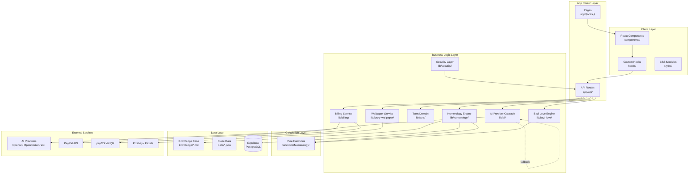

# 📁 NUMELYRA — Project Structure

> **Version**: 0.4.0 · **Framework**: Next.js (App Router) · **Language**: TypeScript · **UI**: Chakra UI + Framer Motion  
> **i18n**: next-intl (vi / en) · **Backend**: Supabase · **Package Manager**: pnpm

---

## 🗂 Tổng quan cây thư mục

```
NumerologyWebApp/
├── app/                          # Next.js App Router — pages & API routes
├── components/                   # React UI components (theo feature)
├── data/                         # JSON data tĩnh (knowledge, art prompts, cards)
├── functions/                    # Pure functions tính toán Numerology
├── hooks/                        # React custom hooks
├── knowledge/                    # Markdown knowledge base (fallback nội dung)
├── lib/                          # Business logic & service modules
├── locales/                      # File dịch i18n (vi.json, en.json)
├── mocks/                        # Mock data cho tests
├── public/                       # Static assets (images, videos, icons)
├── references/                   # Tham chiếu thiết kế (TarotWhisper)
├── scripts/                      # Build scripts, benchmarks, tooling
├── src/                          # i18n configuration
├── styles/                       # Global CSS & module styles
├── supabase/                     # SQL schemas & migrations
├── tests/                        # Unit tests
├── types/                        # TypeScript type declarations
├── utils/                        # Utility helpers
└── [config files]                # Cấu hình project root
```

---

## 📂 Chi tiết từng thư mục

### 1. `app/` — Next.js App Router

Chứa routing, layouts, pages và API routes theo cấu trúc App Router.

```
app/
├── EmotionCache.tsx              # SSR Emotion cache cho Chakra UI
├── providers.tsx                 # React context providers (Chakra, Auth, etc.)
├── robots.ts                     # robots.txt generation
├── sitemap.ts                    # Sitemap XML generation
│
├── [locale]/                     # Dynamic locale routing (vi | en)
│   ├── layout.tsx                # Root layout (fonts, metadata, providers)
│   ├── page.tsx                  # Trang chủ
│   │
│   ├── account/                  # Trang tài khoản người dùng
│   ├── assessment/               # Đánh giá tính cách
│   ├── chat/                     # Chat AI
│   ├── indicators/               # Trang hiển thị chỉ số Numerology
│   ├── login/                    # Đăng nhập
│   ├── register/                 # Đăng ký
│   ├── pricing/                  # Trang giá Pro
│   ├── love-compatibility/       # Bát Tự hợp đôi (Bazi Love)
│   ├── lucky-wallpaper/          # Hình nền may mắn
│   ├── privacy-policy/           # Chính sách bảo mật
│   ├── terms-of-service/         # Điều khoản dịch vụ
│   │
│   │   # --- Numerology Calculator Pages ---
│   ├── birthday-number-calculator/
│   ├── expression-number-calculator/
│   ├── life-path-number-calculator/
│   ├── maturity-number-calculator/
│   ├── personal-year-number-calculator/
│   ├── personality-number-calculator/
│   └── soul-urge-number-calculator/
│
└── api/                          # API Route Handlers
    ├── account/
    │   └── delete/               # Xóa tài khoản
    ├── admin/
    │   └── usage/                # Thống kê sử dụng (admin)
    ├── auth/
    │   └── callback/             # OAuth callback (Supabase Auth)
    ├── bazi-love/
    │   └── reading/              # API phân tích hợp đôi Bát Tự
    ├── billing/
    │   ├── checkout/             # Tạo checkout session
    │   ├── history/              # Lịch sử thanh toán
    │   ├── payos/                # payOS (VietQR) integration
    │   ├── paypal/               # PayPal subscription integration
    │   ├── subscription/         # Quản lý subscription
    │   └── webhook/              # Billing webhooks
    ├── chat/
    │   └── lib/                  # Chat streaming library
    ├── lucky-wallpaper/
    │   ├── generate/             # AI sinh từ khóa → ảnh stock
    │   └── image/                # Proxy / serve ảnh wallpaper
    ├── mailer/                   # (Empty — reserved)
    ├── numerology/
    │   ├── analyze-birthchart/   # Phân tích biểu đồ ngày sinh
    │   ├── initial-analysis/     # Phân tích ban đầu
    │   ├── lazy-indicator/       # Lazy-load từng chỉ số
    │   ├── qa/                   # Q&A (legacy)
    │   └── search/               # Tìm kiếm knowledge
    ├── provider-models/          # Liệt kê AI provider/model configs
    ├── survey/                   # API khảo sát người dùng
    └── tarot/
        └── reading/              # API đọc bài Tarot
```

---

### 2. `components/` — UI Components

Tổ chức theo tính năng (feature-based). Mỗi folder là một module UI độc lập.

```
components/
├── index.ts                      # Barrel exports
├── AnalyticsConsent.tsx           # Banner chấp thuận analytics
├── Disclaimer.tsx                 # Disclaimer pháp lý
├── Footer.tsx                     # Footer chung
├── Header.tsx                     # Header / Navbar
├── InputDate.tsx                  # Component chọn ngày sinh
├── LanguageSwitcher.tsx           # Nút chuyển ngôn ngữ (vi ↔ en)
├── Layout.tsx                     # Wrapper layout chung
│
├── Auth/                          # Authentication
│   ├── AuthModal.tsx              # Modal đăng nhập / đăng ký
│   └── index.ts
│
├── BaziLove/                      # Bát Tự Hợp Đôi (Love Compatibility)
│   ├── BaziLove.module.css        # Styles riêng
│   ├── BaziLoveChat.tsx           # Chat UI cho kết quả
│   ├── BaziLoveForm.tsx           # Form nhập thông tin đôi
│   ├── BaziLoveHistorySidebar.tsx  # Sidebar lịch sử tra cứu
│   ├── BaziLovePage.tsx           # Trang chính
│   └── BaziLoveResultView.tsx     # Hiển thị kết quả phân tích
│
├── Billing/                       # Thanh toán & Pro
│   ├── BillingPanel.tsx           # Panel quản lý billing
│   ├── PricingPage.tsx            # Trang hiển thị giá
│   └── SacredProModal.tsx         # Modal nâng cấp Pro
│
├── calculator/                    # Numerology Calculators
│   └── CalculatorShell.tsx        # Shell chung cho các trang calculator SEO
│
├── Chat/                          # (Empty — reserved cho Chat UI)
│
├── Donate/                        # Donate / Ủng hộ
│   └── index.tsx                  # Component hiển thị QR donate
│
├── FeedBack/                      # Feedback
│   └── index.tsx                  # Widget thu thập phản hồi
│
├── Legal/                         # Trang pháp lý
│   └── LegalPage.tsx              # Privacy Policy & Terms renderer
│
├── LuckyWallpaper/                # Hình nền may mắn
│   ├── LuckyWallpaperCard.tsx     # Card preview wallpaper
│   ├── LuckyWallpaperModal.tsx    # Modal chi tiết & download
│   └── index.ts
│
├── Numerology/                    # Thần số học
│   └── AssessmentPromptModal.tsx  # Modal khảo sát đánh giá tính cách
│
├── Pyra/                          # (Empty — reserved cho tính năng Pyra)
│
├── sites/                         # Reference site designs
│   └── chani-com-6d20749d/        # Clone/reference từ chani.com
│
├── Survey/                        # Khảo sát người dùng
│   ├── PersonalityAssessmentModal.tsx  # Modal trắc nghiệm tính cách
│   ├── SurveyBanner.tsx           # Banner hiển thị survey
│   └── index.ts
│
└── Tarot/                         # Tarot
    ├── MysticalTarot.module.css   # Styles cho Tarot page
    ├── MysticalTarotAltar.tsx     # Khu vực rút bài (Altar)
    ├── MysticalTarotSidebar.tsx   # Sidebar chọn kiểu trải bài
    ├── NuminaTarotPage.tsx        # Trang Tarot chính (51KB — full-featured)
    ├── TarotCard.tsx              # Component lá bài
    ├── TarotDashboard.module.css  # Dashboard styles
    ├── TarotHeader.tsx            # Header riêng cho Tarot
    ├── TarotProfileSelector.tsx   # Selector profile cho Tarot
    └── TarotSprite.tsx            # Sprite animation cho lá bài
```

---

### 3. `hooks/` — Custom React Hooks

```
hooks/
├── index.ts                       # Barrel exports
├── provider-types.ts              # Type definitions cho AI provider settings
├── use-bazi-love.ts               # Hook quản lý flow Bazi Love
├── use-provider-settings.ts       # Hook cấu hình AI provider/model
├── use-tarot-reading.ts           # Hook đọc bài Tarot (streaming)
├── useAnalytics.ts                # Hook analytics tracking
├── useAuth.tsx                    # Hook authentication (Supabase Auth)
├── useBilling.tsx                 # Hook quản lý billing / Pro status
├── useBirthChart.ts               # Hook tính biểu đồ ngày sinh
├── usePersonalityProfile.ts       # Hook personality assessment
├── useProcessNumerology.tsx       # Hook xử lý luồng Numerology chính
├── useProfiles.ts                 # Hook quản lý profiles người dùng
└── useSurveyTrigger.ts            # Hook trigger hiển thị survey
```

---

### 4. `lib/` — Business Logic & Services

Core logic, tách biệt khỏi UI. Chia theo domain.

```
lib/
├── supabaseClient.ts              # Supabase client factory (legacy, xem lib/supabase/)
├── uuid.ts                        # UUID v7 generation
│
├── ai/                            # AI Provider Cascade
│   ├── benchmark.ts               # Benchmark runner cho các model
│   ├── model-config.ts            # Cấu hình model (tên, token limits)
│   ├── provider-cascade.ts        # Multi-provider fallback logic (13KB)
│   ├── response-generator.ts      # Stream response generation
│   └── types.ts                   # AI type definitions
│
├── bazi-love/                     # Engine Bát Tự Hợp Đôi
│   ├── engine.ts                  # Core engine tính toán (77KB — module lớn nhất)
│   ├── prompts.ts                 # AI prompt templates
│   ├── relation-intelligence.ts   # Phân tích quan hệ đôi
│   ├── schemas.ts                 # Zod validation schemas
│   └── types.ts                   # Type definitions
│
├── billing/                       # Payment Processing
│   ├── access.ts                  # Kiểm tra quyền truy cập Pro
│   ├── payos.ts                   # payOS (VietQR) integration
│   ├── paypal.ts                  # PayPal subscription integration
│   └── types.ts                   # Billing types
│
├── lucky-wallpaper/               # Lucky Wallpaper Service
│   ├── ai-prompt-synthesizer.ts   # Tổng hợp prompt cho AI
│   ├── constants.ts               # Hằng số (categories, styles)
│   ├── image-service.ts           # Service lấy ảnh stock (Pixabay/Pexels)
│   ├── keyword-service.ts         # AI sinh keywords tìm kiếm
│   ├── prompt-builder.ts          # Xây prompt cho wallpaper
│   └── wallpaper-workflow.ts      # Orchestration workflow
│
├── markdown/                      # Markdown Processing
│   └── presentation.ts            # Render markdown → React
│
├── numerology/                    # Numerology Engine
│   ├── calculator-content.ts      # SEO content cho calculator pages (52KB)
│   └── calculator-engine.ts       # Engine tính toán cho calculators
│
├── security/                      # Security & Validation
│   ├── provider-url.ts            # Validate provider URLs
│   ├── rate-limit.ts              # Rate limiting logic
│   ├── redirect.ts                # Safe redirect helpers
│   ├── request.ts                 # Request validation
│   └── schemas.ts                 # Security Zod schemas
│
├── seo/                           # SEO Utilities
│   └── metadata.ts                # Dynamic metadata generation
│
├── supabase/                      # Supabase Clients (mới)
│   ├── admin.ts                   # Admin client (service role)
│   ├── client.ts                  # Browser client
│   └── server.ts                  # Server-side client (SSR)
│
├── tarot/                         # Tarot Domain Logic
│   ├── cards.ts                   # 78 lá bài Tarot data (29KB)
│   ├── draw.ts                    # Logic rút bài
│   ├── presentation.ts            # Format kết quả hiển thị
│   ├── prompts.ts                 # AI prompt templates cho Tarot
│   ├── spreads.ts                 # Các kiểu trải bài
│   └── types.ts                   # Tarot type definitions
│
└── usage/                         # Usage Tracking
    └── usage-meter.ts             # Đo lường & giới hạn usage
```

---

### 5. `functions/` — Pure Calculation Functions

Chứa các hàm tính toán Numerology thuần (không phụ thuộc React/Next.js).

```
functions/
├── index.ts                       # Barrel exports
├── removeAccents.ts               # Loại bỏ dấu tiếng Việt
│
└── Numerology/                    # Core Numerology Calculations
    ├── index.ts                   # Barrel exports
    ├── getAttitude.ts             # Tính Số Thái Độ
    ├── getBalance.ts              # Tính Số Cân Bằng
    ├── getBirthChartArrows.ts     # Tính mũi tên biểu đồ ngày sinh
    ├── getBridges.ts              # Tính Số Cầu Nối
    ├── getKarmicDebts.ts          # Tính Nghiệp Số
    ├── getMissingNumbers.ts       # Tính Số Thiếu (Karmic Lessons)
    ├── getMission.ts              # Tính Số Sứ Mệnh (Expression)
    ├── getPassion.ts              # Tính Số Đam Mê (Heart's Desire)
    ├── getPersonality.ts          # Tính Số Nhân Cách (Personality)
    ├── getRationalThinking.ts     # Tính Số Tư Duy Lý Trí
    ├── getSoul.ts                 # Tính Số Linh Hồn (Soul Urge)
    ├── getValueInAlphabets.ts     # Chuyển chữ cái → giá trị số
    ├── getWalksOfLife.ts          # Tính Số Đường Đời (Life Path)
    ├── subtractAdjacent.ts        # Hàm trừ liền kề (Challenges)
    └── sumAdjacent.ts             # Hàm cộng liền kề (Pinnacles)
```

---

### 6. `knowledge/` — Markdown Knowledge Base

Kho tri thức Numerology dưới dạng Markdown. Đây là **fallback** khi Supabase không khả dụng.

```
knowledge/
├── life_path_{1..9,10,11,22_4,33_6}.md    # Đường Đời (13 files)
├── life_path_all.md                        # Tổng hợp tất cả Đường Đời
│
├── mission_{1..9,11,22,33}.md              # Sứ Mệnh / Biểu Đạt (12 files)
├── personality_{1..9,11,22}.md             # Nhân Cách (11 files)
├── soul_{1..9,11,22}.md                    # Linh Hồn
├── passion_{1..9}.md                       # Đam Mê
├── maturity_{1..9,11,22}.md                # Trưởng Thành
├── birthday_{1..11,22}.md                  # Ngày Sinh
│
├── attitude_{1..9}.md                      # Thái Độ
├── balance_{1..9}.md                       # Cân Bằng
├── rational_thought_{1..9,11,22}.md        # Tư Duy Lý Trí
│
├── arrow_*.md                              # Mũi Tên biểu đồ (8 mũi tên)
├── birth_chart_isolated.md                 # Các con số cô lập trong biểu đồ
├── name_chart_matrix.md                    # Ma trận biểu đồ tên
│
├── bridge_life_mission_{0..8}.md           # Cầu Nối Đường Đời – Sứ Mệnh
├── bridge_maturity_passion_{0..8}.md       # Cầu Nối Trưởng Thành – Đam Mê
├── bridge_soul_personality_{0..8}.md       # Cầu Nối Linh Hồn – Nhân Cách
│
├── challenge_{0..8}.md                     # Thử Thách
├── pinnacle_{1..11}.md                     # Đỉnh Cao
│
├── karmic_debt_{13_4,14_5,16_7,19_1}.md   # Nghiệp Số
├── karmic_lesson_{1..9}.md                 # Bài Học Nghiệp
│
├── personal_year_{1..9}.md                 # Năm Cá Nhân
├── personal_month_{1..9}.md                # Tháng Cá Nhân
├── personal_day_{1..9}.md                  # Ngày Cá Nhân
│
├── daily_decision_*.md                     # Gợi ý quyết định hàng ngày
│   ├── drink_*                             #   - Đồ uống (8 categories × 9 days)
│   ├── fashion_*                           #   - Thời trang (9 categories × 9 days)
│   ├── food_*                              #   - Ẩm thực (8 categories × 9 days)
│   ├── lifestyle_*                         #   - Lối sống (6 categories × 9 days)
│   ├── relationship_*                      #   - Quan hệ (6 categories × 9 days)
│   ├── relax_*                             #   - Thư giãn (8 categories × 9 days)
│   ├── wellness_*                          #   - Sức khỏe (8 categories × 9 days)
│   └── work_*                              #   - Công việc (8 categories × 9 days)
│
└── daily_decision_manifest.json            # Manifest map cho daily decisions
```

> **Tổng**: ~500+ Markdown files, mỗi file chứa nội dung chuyên sâu cho một chỉ số số học cụ thể.

---

### 7. `data/` — Static JSON Data

```
data/
├── art_prompts_200.json           # 200 prompt sinh art cho wallpaper (154KB)
├── lucky_unlucky_14_collages.json # 14 collage may mắn / không may mắn
├── master_knowledge.json          # Master knowledge map (84KB)
├── mooks.ts                       # Mock data exports
└── numerology_24_cards.json       # 24 lá bài Numerology
```

---

### 8. `styles/` — CSS Styles

```
styles/
├── globals.css                    # CSS toàn cục
├── Home.module.css                # Styles trang chủ
├── chani-globals.css              # Global styles (design system từ chani.com)
├── chani-inner.css                # Inner page styles (191KB)
├── numerology-calculators.css     # Styles cho calculator pages
└── tarot-papercut.css             # Tarot paper-cut theme (53KB)
```

---

### 9. `locales/` — Internationalization

```
locales/
├── vi.json                        # Bản dịch tiếng Việt (39KB)
└── en.json                        # Bản dịch tiếng Anh (31KB)
```

---

### 10. `src/` — Source Configuration

```
src/
└── i18n/
    ├── navigation.ts              # i18n routing configuration
    ├── request.ts                 # Server-side i18n request handler
    └── routing.ts                 # Locale routing config
```

---

### 11. `supabase/` — Database Schema & Migrations

```
supabase/
├── auth_schema.sql                # Bảng & RLS cho authentication
├── billing_schema.sql             # Schema billing đầy đủ (16KB)
├── preflight_vector_cleanup.sql   # Script kiểm tra trước khi xóa vector
│
└── migrations/
    ├── 20260911_paypal_payos_billing.sql    # Migration billing PayPal + payOS
    ├── 20260911_remove_vector_rag.sql       # Xóa vector/RAG schema cũ
    └── 20260912_abandoned_paypal_checkout.sql # Xử lý checkout bỏ dở
```

---

### 12. `tests/` — Unit Tests

```
tests/
├── bazi-love-api.test.ts          # Test API Bazi Love
├── bazi-love-engine.test.ts       # Test engine Bazi Love
├── billing-payments.test.ts       # Test thanh toán
├── knowledge-lookup.test.ts       # Test tra cứu knowledge
├── lazy-indicator-fallback.test.ts # Test lazy indicator fallback
├── llm-benchmark.test.ts          # Test LLM benchmark
├── markdown-presentation.test.ts  # Test render markdown
├── numerology-engine.test.ts      # Test engine Numerology
├── provider-cascade.test.ts       # Test AI provider cascade (21KB)
├── security-usage.test.ts         # Test security & usage limits
├── tarot-domain.test.ts           # Test Tarot domain logic
├── tarot-presentation.test.ts     # Test Tarot presentation
├── uuid.test.ts                   # Test UUID generation
└── wallpaper-stock.test.ts        # Test wallpaper stock images (15KB)
```

---

### 13. `scripts/` — Build & Tooling Scripts

```
scripts/
├── benchmark-llm.ts               # Benchmark AI models (16KB)
├── benchmark-llm-report.ts        # Tạo báo cáo benchmark
├── benchmark-llm-e2e.ts           # E2E benchmark qua HTTP
├── generate_all_batches.ts        # Sinh batch nội dung (85KB)
├── test_engine.ts                 # Test nhanh engine
├── test-stock-apis.ts             # Test Pixabay/Pexels APIs
│
│   # --- Python: Sinh Knowledge Base ---
├── build_*_knowledge.py           # ~25 scripts sinh knowledge MD files
│   ├── build_arrow_knowledge.py
│   ├── build_attitude_knowledge.py
│   ├── build_balance_knowledge.py
│   ├── build_birthday_knowledge.py
│   ├── build_bridge_*_knowledge.py
│   ├── build_challenge_knowledge.py
│   ├── build_daily_decision_knowledge.py  # (123KB — lớn nhất)
│   ├── build_karmic_*_knowledge.py
│   ├── build_maturity_knowledge.py
│   ├── build_mission_knowledge.py
│   ├── build_passion_knowledge.py
│   ├── build_personal_*_knowledge.py
│   ├── build_personality_knowledge.py
│   ├── build_pinnacle_knowledge.py
│   ├── build_rational_thought_knowledge.py
│   ├── build_soul_knowledge.py
│   └── build_subconscious_knowledge.py
│
│   # --- Python: Art & Asset Processing ---
├── build_art_prompts_200.py       # Sinh 200 art prompts
├── generate_all_art.py            # Sinh tất cả artwork
├── generate_login_art.py          # Sinh art cho trang login
├── generate_personality_traits_art.py
├── process_tarot_media.py         # Xử lý media Tarot
├── process_tarot_ui_assets.py     # Xử lý UI assets Tarot
├── clean_animation_bg.py          # Xóa background animation
├── remove_petal_bg.py             # Xóa background cánh hoa
├── run_free_image_gen_batch.py    # Chạy batch sinh ảnh
│
│   # --- Python: Audit & Docs ---
├── audit_daily_decision_knowledge.py
├── audit_knowledge_base.py
├── deep_content_audit.py
├── build_docs.py
├── build_markdown_knowledge.py
├── build_namechart_knowledge.py
├── build_birthchart_isolated_knowledge.py
└── capture_screenshots.py
```

---

### 14. `public/` — Static Assets

```
public/
├── BingSiteAuth.xml               # Bing webmaster verification
├── favicon.ico                    # Favicon
│
├── animation/                     # Animated assets (Lottie, GIFs)
├── bazi-love/                     # Assets cho Bazi Love feature
├── logo/                          # Logo files
├── sites/                         # Site-specific assets
├── videos/                        # Video assets
│
├── images/
│   ├── MomoQR.jpeg                # Momo donate QR code
│   ├── numerologyPNG.png          # Main numerology hero image
│   ├── auth/                      # Login/register art
│   ├── card/                      # Card designs
│   ├── cards/                     # Numerology card images
│   ├── collages/                  # Collage images (lucky/unlucky)
│   ├── lucky-wallpapers/          # Cached lucky wallpaper images
│   ├── numerology/                # Numerology-related images
│   └── personality/               # Personality trait illustrations
│
└── tarot/
    ├── cards/                     # 78 lá bài Tarot images
    ├── ui/                        # UI elements cho Tarot
    └── UI_item/                   # Additional Tarot UI items
```

---

### 15. `utils/` — Utility Helpers

```
utils/
├── constaints.ts                  # Constants chung
├── numerology-images.ts           # Mapping số → hình ảnh (9KB)
├── personalityTypes.ts            # Dữ liệu 16 types tính cách (11KB)
├── themes.ts                      # Theme configuration
└── types.ts                       # Shared utility types
```

---

### 16. `types/` — TypeScript Declarations

```
types/
└── chakra-ui-react19.d.ts         # Type augmentation cho Chakra UI + React 19
```

---

### 17. Config Files (Root)

| File | Mô tả |
|---|---|
| `package.json` | Dependencies & scripts (pnpm) |
| `pnpm-workspace.yaml` | pnpm workspace config |
| `pnpm-lock.yaml` | Lockfile |
| `tsconfig.json` | TypeScript config (baseUrl `.`, paths `@/*`) |
| `next.config.mjs` | Next.js config + next-intl plugin |
| `eslint.config.mjs` | ESLint flat config |
| `.lintstagedrc.js` | Lint-staged config (husky) |
| `.env` / `.env.example` / `.env.local` | Environment variables |
| `.gitignore` | Git ignore rules |
| `renovate.json` | Dependabot/Renovate auto-update |
| `proxy.ts` | Dev proxy server |

---

### 18. Documentation Files (Root)

| File | Mô tả |
|---|---|
| `README.md` | Hướng dẫn cài đặt, kiến trúc, benchmark |
| `BETA_RUNBOOK.md` | Runbook cho beta deployment |
| `LANGUAGE_AUDIT.md` | Kiểm tra ngôn ngữ i18n |
| `SECURITY.md` | Chính sách bảo mật |
| `THIRD_PARTY_NOTICES.md` | Thông báo bên thứ ba |
| `system_solution.md` | Tài liệu giải pháp hệ thống |

---

## 🏗 Kiến trúc tổng quan



---

## 🔑 Tech Stack Chi Tiết

| Lớp | Công nghệ |
|---|---|
| **Framework** | Next.js (App Router, React 19) |
| **Language** | TypeScript 5.9 |
| **UI Library** | Chakra UI v2 + Emotion |
| **Animation** | Framer Motion |
| **i18n** | next-intl (vi, en) |
| **State** | React hooks + Context |
| **Backend** | Supabase (Auth, PostgreSQL, RLS) |
| **AI** | Vercel AI SDK + OpenAI SDK, multi-provider cascade |
| **Payments** | PayPal (subscription), payOS (VietQR) |
| **Stock Images** | Pixabay, Pexels |
| **Validation** | Zod |
| **Date** | Day.js, lunar-typescript |
| **Markdown** | react-markdown + rehype-katex + remark-math |
| **Testing** | Node.js built-in test runner |
| **Linting** | ESLint + Husky + lint-staged |
| **Package Manager** | pnpm (workspace) |
| **Deployment** | Vercel (assumed) |

---

## 📊 Thống kê Project

| Metric | Giá trị |
|---|---|
| Tổng thư mục (top-level) | ~26 |
| Tổng files cấu hình (root) | ~22 |
| Components UI | ~40+ files trong 14 sub-modules |
| Custom Hooks | 13 hooks |
| API Routes | 12 domains, ~20+ endpoints |
| Knowledge files | ~500+ markdown files |
| Unit Tests | 14 test files |
| Build Scripts | ~47 scripts (Python + TypeScript) |
| Locales | 2 (vi, en) |
| CSS files | 6 stylesheets |
